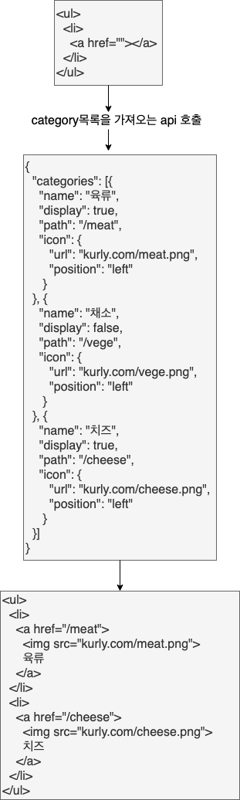

## DOM이란

DOM이란 웹 페이지의 HTML을 계층화시켜 트리구조로 만든 객체(Object) 모델이다. 
JVS는 이 model로 웹 페이지에 접근하고, 페이지를 수정할 수 있다. 
즉, DOM은 HTML인 웹페이지와 스크립팅언어(JVS)를 서로 잇는 역할을 한다.

```
HTML/CSS <--> DOM <--> JVS
```

그래서 JVS는 어떻게 HTML에 접근할 수 있을까?
바로 document라는 전역객체를 통해 접근할 수 있다.

JVS의 document 객체는 DOM 구조를 접근하는 관문이며, document 객체는 HTML 문서를 나타낸다고 말할 수 있다.


## 왜 HTML에 접근해야 할까

개발자도구 세션에 보았던 마켓컬리의 사이트를 보면 카테고리 목록을 HTML에 "육류, 채소 등등.." 직접 작성하지 않았다.
대신 api를 통해 서버에서 카테고리 목록의 데이터를 가져왔다.



document 객체는 DOM 트리의 root node에 접근하게 해준다.
document객체로 요소(element)에 접근하듯이 요소의 속성(attribute)에도 접근할 수 있다.
그렇게 class, id도 추가하고 style도 수정할 수 있다.

요소의 내용(content)는 innerHTML으로 접근하고 수정할 수 있다.

```css
document.body.innerHTML = '내용 다 바꿈';
```
위의 body 태그 내부에 있는 것을 '내용 다 바꿈'이라는 텍스트로 바꾼것이다.
body 태그에 엄청나게 많은 요소가 있더라도 innerHTML을 사용하면 내용이 전부 교체된다.

만약, 특정 element로 접근하고 싶다면 어떻게 해야할까?
tag, class, id와 같은 css selector로 접근이 가능하다.

```css
let blueElement = document.querySelector('.blue');
blueElement.style.backgroundColor = 'blue';
```

위와 같은 스타일도 수정 가능하지만 css에서 사용했던 property 명과는 조금 달라보인다.
background-color 대신 backgroundColor로 접근한것에 주목하자.

JVS에서 style 수정할 때 hypen(-)은 사용할 수 없다.
객체(object)에서 프로퍼티 이름에 hypen(-)을 사용할 수 없었던 이유와 같다.
그러므로 style의 프로퍼티에 접근하고 싶을 때, camelCase로 바꾸면 된다.

element를 생성할 수도 있다.
.createElement(tagName) 함수를 사용하면 요소(element)를 만들 수 있다. 위의 함수는 요소를 만들기만 할 뿐, 아직 HTML의 어디에 들어가야 할지는 지정하지 않았다.
요소를 만든 후, 어딘가의 element에 append 시켜줘야 한다.
innerHTML은 내용을 전부 대체시켰다면 appendChild 함수는 요소의 뒤쪽에 붙여준다.

